<div align="center">




<br>

[](https://norazfizal.dev)
[](https://www.linkedin.com/in/norazfizal-razak/)

</div>

## About

I design and lead cloud and platform work on AWS, and I care about the people and delivery around it as much as the
technology. I have worked the whole ladder, so I understand how things behave at the OS level, how they scale in the
cloud, and how decisions land with stakeholders.

```text
Service Desk → Linux System Engineer → Project Manager → Technical Account Manager → Cloud Engineer → Architect
```

## What I work with

**Cloud**


**Infrastructure as code and automation**


**Linux, monitoring and service management**


## Focus

- Cloud migration and transformation
- AWS foundations: compute, serverless, database, connectivity and storage
- Security, hardening and compliance
- Stakeholder, customer and project delivery

## This site

My portfolio at [norazfizal.dev](https://norazfizal.dev) is a single static page, served from a private S3 bucket
through CloudFront and deployed with Terraform.

<picture>
  <source media="(prefers-color-scheme: dark)" srcset="https://raw.githubusercontent.com/dreadlessdream/dreadlessdream/output/github-snake-dark.svg">
  <source media="(prefers-color-scheme: light)" srcset="https://raw.githubusercontent.com/dreadlessdream/dreadlessdream/output/github-snake.svg">
  
</picture>
